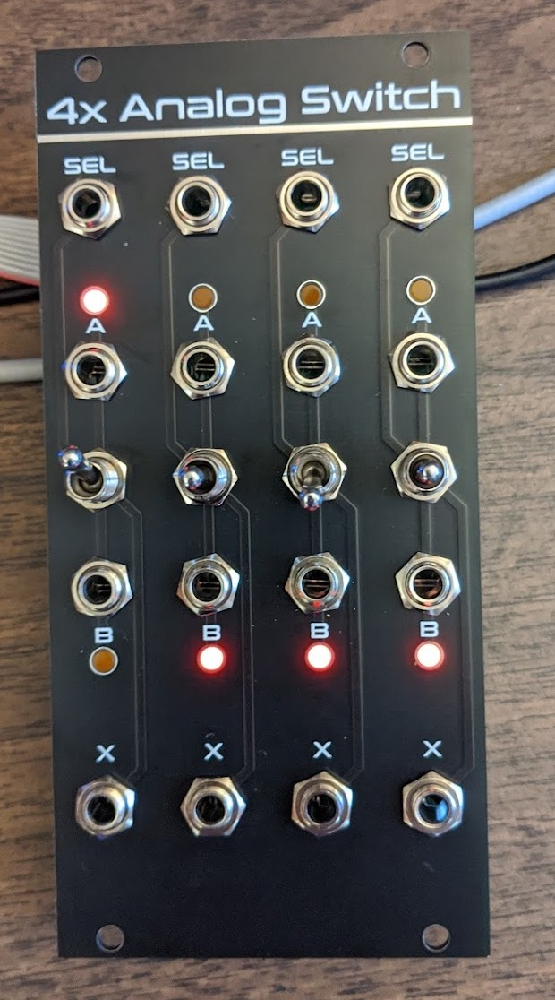

# 4x Analog Switch

This is a quad analog switch based on the [MAX333A](https://datasheets.maximintegrated.com/en/ds/MAX333A.pdf) analog switch IC. The jacks are *directly* connected to the switch IC for minimum resistance and maximum versatility. 

The switch may be used in either direction.

* Send two signals into the `A` and `B` ports, and select which one goes to the `X` port.
* Send a signal into the `X` port, and select whether it goes to the `A` or `B` port. The other port is pulled low with a 100k resistor.

The connection is selected by both the toggle switch and the `SEL` input. The toggle is a 3-position switch.

* When the switch is in the up position, `A` is selected.
* When the switch is in the down position, `B` is selected.
* When the switch is in the middle position, the `SEL` input selects `A` or `B`.
* If `SEL` is high (above 3V), `A` is selected. If `SEL` is low (below 2V), `B` is selected. The `SEL` input has a Schmitt trigger so that slowly changing inputs won't cause glitches.
* If the `SEL` input is unconnected and the switch is in the middle position, `B` is selected by default.

In addition to the standard 10-pin Eurorack power header, I've included two daisy-chain power headers at the top corners of the board. This will allow adjacent units to share power. I plan to add these to most of my new designs.

## BOM

Please see the [interactive BOM](https://htmlpreview.github.io/?https://github.com/terrabite3/4x-Analog-Switch/blob/main/bom/ibom.html) for full details. Most of the parts are super common and any established maker will have them in stock. The exception is the MAX333A itself, which is rather expensive -- $16 each at this time. I only used it because I already had them in my stash!

Note that the toggle switches must be SPDT **ON-OFF-ON** configuration!

### MAX4533 substitution

After designing this module, I learned of the [MAX4533](https://datasheets.maximintegrated.com/en/ds/MAX4533.pdf), which is pin compatible with the MAX333A. It features fault protection and is actually $4 cheaper at this writing. The only downside I see is somewhat higher on resistance. I recommend that you use this part instead.

## License

* You are free to build this design, modify it, and use parts of it in other designs.
* Most PCB fabs have a minimum order of 5 units. You may sell excess PCBs as bare PCBs, kits, or fully assembled modules. Just don't order extras with the intent of selling them.
* If you make substantial changes to the design, then you may treat the design as your own. For example, adding features, removing features, or changing the form factor. Changing the font on the panel and other superficial changes would not count.
* I urge you to release any derivative works under similar terms, but you don't have to.